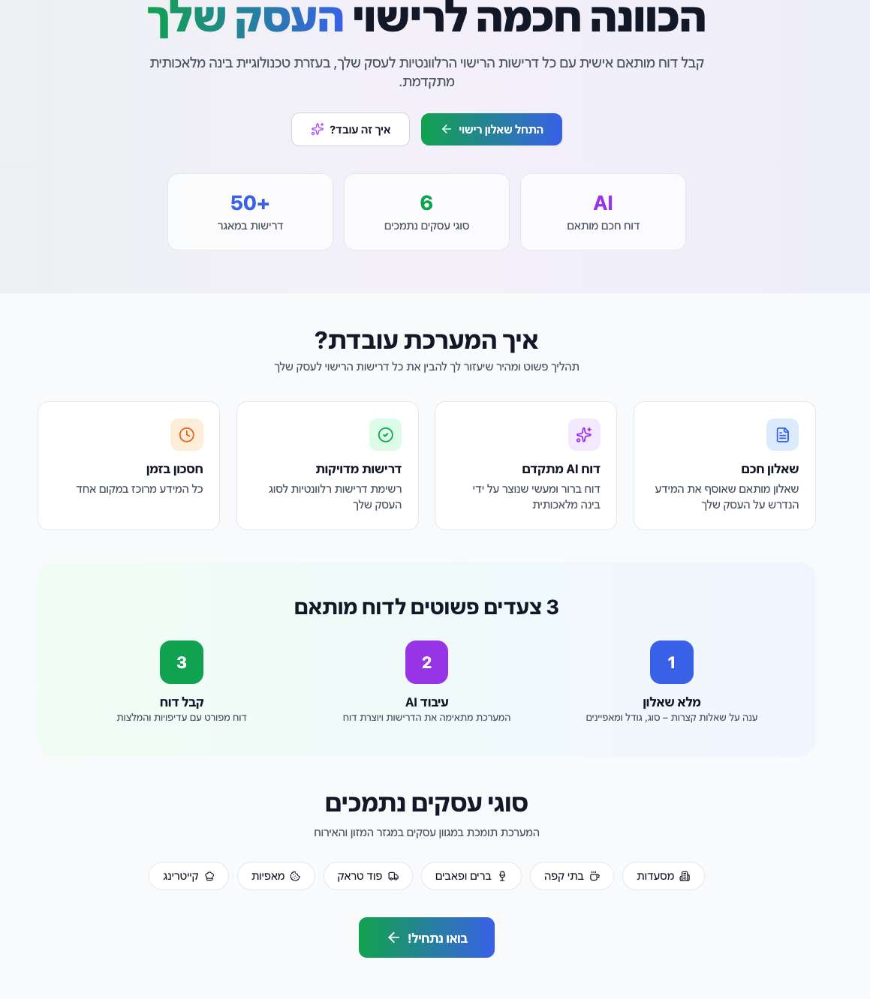
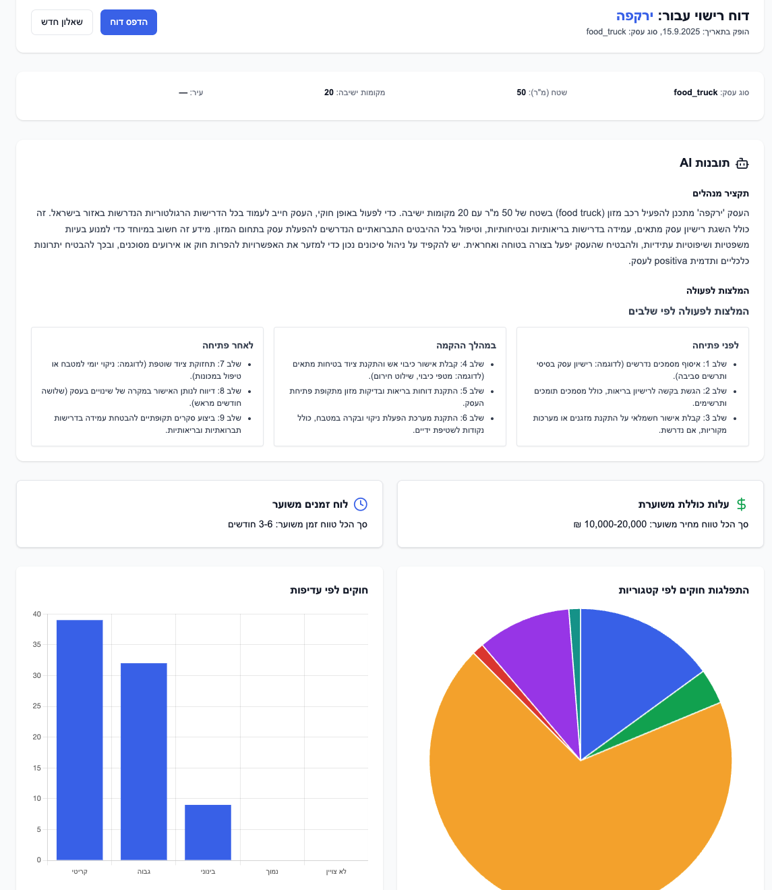
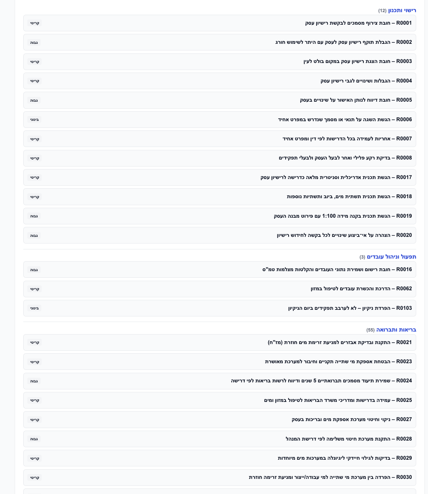

# Smart Licensing – Business Licensing Assessment System

## Project Description

Smart Licensing is a hybrid system designed to assess business licensing requirements in Israel. It combines deterministic rule-based logic with Generative AI to provide accurate, regulatory-compliant reports for business owners.

The system operates in two main modes:
1.  **Licensing Report Generation:** Matches business characteristics against a structured database of regulatory rules, then uses an LLM to generate an executive summary, action plan, and cost estimates.
2.  **Regulatory Q&A (RAG):** A Retrieval-Augmented Generation system that allows users to ask free-text questions about licensing regulations, retrieving answers from indexed regulatory documents.

## System Architecture

The project follows a decoupled client-server architecture:

*   **Frontend:** Static HTML, CSS (Tailwind), and vanilla JavaScript. Serves as a wizard for data collection and a dashboard for report viewing.
*   **Backend:** Python Flask application. Handles API requests, rule matching logic, and OpenAI integrations.
*   **Data Storage:**
    *   `json_rules/`: Directory containing structured JSON files defining regulatory rules.
    *   `backend/chroma_db/`: ChromaDB vector database containing embedded chunks of regulatory documents for the RAG system (replaces the previous JSON-based index).
*   **AI Integration:** OpenAI `gpt-4o-mini` is used for:
    *   Summarizing matched rules into a cohesive report.
    *   Answering questions based strictly on retrieved context.

### Logic Flow

#### 1. Report Generation (`/api/generate-report`)
The report generation process is a hybrid of deterministic and probabilistic logic:
1.  **Input:** User provides business details (type, area, seating, boolean flags).
2.  **Rule Matching (Deterministic):** The backend iterates through all rules in `json_rules/*.json`. A rule matches only if:
    *   The business type is in the rule's `business_type` list.
    *   Numeric constraints (area, seating) are met.
    *   Boolean conditions (gas, meat, alcohol) match the input.
3.  **AI Synthesis (Probabilistic):** The matched rules are injected into a prompt for `gpt-4o-mini`. The AI is instructed to:
    *   Generate an executive summary.
    *   Create a step-by-step recommendation plan (Pre-opening, Setup, Post-opening).
    *   Estimate costs and timelines based on the rules provided.
    *   **Note:** The AI does *not* invent regulations; it summarizes the provided matched rules.

#### 2. RAG Q&A (`/api/rag`)
1.  **Indexing (Offline):** The script `build_rag_index.py` parses the regulatory DOCX file (`regulations.docx`), chunks the text into logical sections, and generates embeddings using OpenAI's `text-embedding-3-small` model. These embeddings are stored in a ChromaDB vector database for efficient similarity search.
2.  **Retrieval (Online):** When a user asks a question:
    *   The question is embedded using the same model.
    *   ChromaDB performs cosine similarity search against the vector database.
    *   The top 5 most relevant text chunks are retrieved with their similarity scores.
3.  **Generation:** `gpt-4o-mini` answers the question using *only* the retrieved context, with strict instructions to state if information is missing. The system includes source references for transparency.

## Installation & Setup

### Prerequisites
*   Python 3.11+
*   OpenAI API Key
*   Docker and Docker Compose (for production deployment)

### Local Installation

1.  **Clone the repository:**
    ```bash
    git clone <repository_url>
    cd <repository_name>
    ```

2.  **Install dependencies:**
    ```bash
    pip install -r backend/requirements.txt
    ```

3.  **Set up environment variables:**
    Create a `.env` file in the project root:
    ```bash
    echo "OPENAI_API_KEY=your_key_here" > .env
    ```
    Or export it:
    ```bash
    export OPENAI_API_KEY=your_key_here
    ```

4.  **Run the application:**
    ```bash
    # Option 1: Run directly
    python backend/app.py
    # Server starts at http://localhost:5001 (or 5000 if available)
    
    # Option 2: Use the frontend proxy server (recommended for local dev)
    python serve_frontend.py
    # Frontend available at http://localhost:8000
    ```

### Building the RAG Index
The RAG system requires a vector index to be built from the regulatory documents. This is a one-time setup (or whenever documents are updated):

```bash
# Build the index (this will take a few minutes)
python backend/build_rag_index.py 1 1

# The script will:
# - Extract text from regulations.docx
# - Split into logical sections
# - Generate embeddings using OpenAI
# - Store in ChromaDB vector database
```

**Note:** The index is stored in `backend/chroma_db/` and contains approximately 380 chunks from the regulatory document.

## API Documentation

### `POST /api/generate-report`
Generates a full licensing report based on business parameters.

**Request Body:**
```json
{
  "business_name": "My Cafe",
  "business_type": "cafe",
  "area_sqm": 50,
  "seating_capacity": 20,
  "has_gas": false,
  "serves_meat": false,
  "has_delivery": true,
  "has_alcohol": false
}
```

**Response:**
Returns a JSON object containing:
*   `matched_rules`: Array of raw rule objects from the JSON database.
*   `executive_summary`: AI-generated summary string.
*   `recommendations`: AI-generated object with `before_opening`, `during_setup`, `after_opening` lists.
*   `estimated_cost`: AI-generated cost estimate string.
*   `estimated_time`: AI-generated timeline string.

### `POST /api/rag`
Answers a specific question using the indexed regulatory documents.

**Request Body:**
```json
{
  "question": "What are the ventilation requirements for a kitchen?"
}
```

**Response:**
```json
{
  "answer": "The answer based on the document context...",
  "sources": [
    { "id": "section_id", "preview": "Text snippet..." }
  ]
}
```

## Recent Updates

### Vector Database Integration (December 2024)
- **Migrated from JSON to ChromaDB:** Replaced the JSON-based RAG index with ChromaDB, a dedicated vector database for improved performance and scalability.
- **Improved Search:** ChromaDB provides optimized cosine similarity search with better handling of large document collections.
- **Persistent Storage:** Vector embeddings are now stored in a persistent database that survives container restarts.
- **Better Error Handling:** Enhanced error messages and validation for the RAG endpoint.

### Technical Improvements
- Added `python-dotenv` support for easier environment variable management
- Improved Docker build process to include regulatory documents
- Enhanced deployment workflow to automatically build RAG index
- Added CORS support for local development
- Renamed regulatory document to `regulations.docx` for simplicity

## Screenshots

The system includes a modern, user-friendly interface:

- **Homepage:** Overview of the system with navigation to different features
  

- **RAG Q&A Interface:** Interactive question-answering system with popular questions and source references
   *(Add your screenshot here)*

- **Report Generation:** AI-generated licensing reports with recommendations
  

- **Rules List:** Structured view of applicable regulations
  

## Known Limitations

1.  **Data Staticity:** The system relies on static JSON files and a pre-built RAG index. Changes in regulations require manually updating the JSON files or re-running the index builder.
2.  **Rule Coverage:** The accuracy of the "Matched Rules" depends entirely on the completeness of the `json_rules` database.
3.  **AI Hallucinations:** While the prompts are engineered to be grounded in the provided context, LLMs may still occasionally hallucinate or misinterpret complex regulatory nuances.
4.  **Language:** The system is currently optimized for Hebrew input and output.
5.  **Vector Database:** The ChromaDB index must be rebuilt if the source document (`regulations.docx`) is updated.

---

**Made by [Ariel Halevy](https://github.com/arielhalevy123) and [Ari Guterman](https://github.com/Gutismall)**
